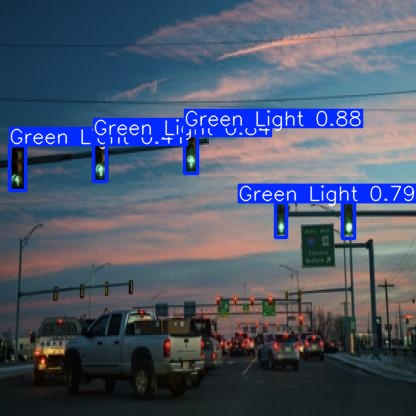
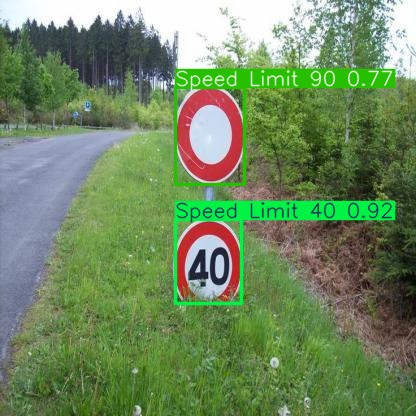

# Traffic Sign Detection System With YOLOv5 🚦

A complete solution for detecting traffic signs using YOLOv5, with a FastAPI backend and Streamlit dashboard.




## 🚀 Features
- **Real-time detection** of 15 traffic sign classes
- **Web API** for integration with other apps
- **Interactive dashboard** with visualization

## 🛠️ Installation 
  ```bash
  git clone https://github.com/trongkhanh083/traffic-sign-detection-yolo.git
  cd traffic-sign-detection-yolo
  pip install -r requirements.txt
  ```

## 📡 Usage 
### 1. Web API with Render
https://yolov5-api-ldqh.onrender.com/

#### Check API endpoint
  ``` bash
  curl -X POST -F "file=@test.jpg" https://yolov5-api-ldqh.onrender.com/predict
  ```
### 2. Demo with Streamlit
https://traffic-sign-detection-yolo-x6wavcgbmji9eucets2yjy.streamlit.app/

#### Run on local
  ``` bash
  streamlit run app/dashboard.py
  ```

## 🎨 Customization 
- **Add new signs:** Retrain model with additional classes
- **Change colors:** Modify box_color in dashboard.py
- **Adjust sensitivity:** Edit conf_threshold in API